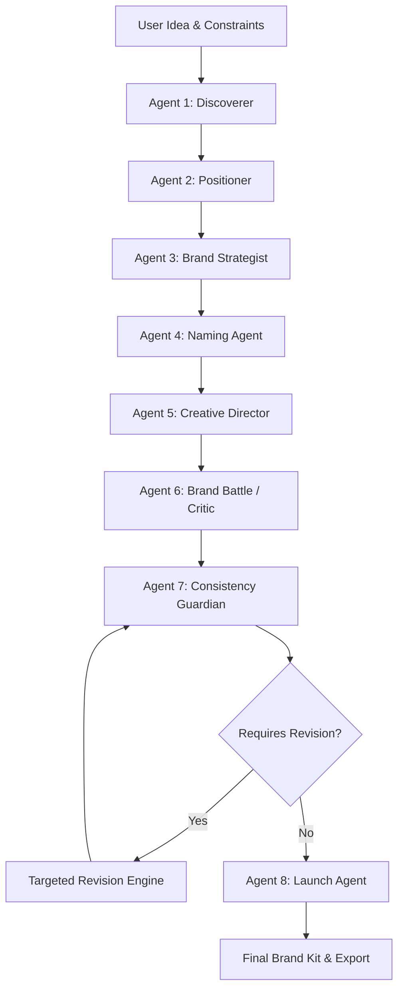

# BrandForge — AI Reasoning Pipeline & Workflow Architecture

This document specifies the exact 8-agent reasoning pipeline, data contracts, input/output schemas, information flow, human-in-the-loop gates, and revision loops in BrandForge.

---

## 1. End-to-End Conceptual Flow



---

## 2. Central Shared State: `BrandState`

All agents interact with a typed, validated state container. Data is never passed as uncontrolled unstructured blobs.

```python
class BrandState(TypedDict, total=False):
    project_id: str
    run_id: str
    idea: str
    constraints: Dict[str, Any]

    discovery: Dict[str, Any]       # DiscovererOutput
    positioning: Dict[str, Any]     # PositionerOutput
    personality: Dict[str, Any]     # StrategistOutput
    naming: Dict[str, Any]          # NamingOutput
    visual_direction: Dict[str, Any] # CreativeDirectorOutput

    critique: Dict[str, Any]        # CriticOutput
    consistency: Dict[str, Any]     # ConsistencyGuardianOutput
    launch: Dict[str, Any]          # LaunchAgentOutput

    selected_direction: Dict[str, Any] # User choices (selected name, positioning)
    status: str
    revision_count: int
    errors: List[str]
```

---

## 3. Node Specifications & Information Flow

### Agent 1: Discoverer
- **Input**: `state["idea"]`, `state["constraints"]`
- **Responsibility**: Parses raw, unstructured user ideas into concrete audience segments, core problems, assumptions, and foundational questions. Does not prematurely invent branding.
- **Output Schema**: `DiscovererOutput`
  - `problem`: str
  - `target_users`: List[UserSegment(segment, needs, pain_points)]
  - `context`: str
  - `goals`: List[str]
  - `constraints`: List[str]
  - `assumptions`: List[str]
  - `open_questions`: List[str]
- **State Written**: `state["discovery"]`
- **SSE Event**: `stage_completed` (`stage: "discover"`)
- **Failure Mode**: Bounded retry with error state reporting.

### Agent 2: Positioner
- **Input**: `state["discovery"]`
- **Responsibility**: Determines strategic market category, core problem statement, value proposition, competitive differentiator, proof points, and strategic positioning options.
- **Output Schema**: `PositionerOutput`
  - `category`: str
  - `core_problem`: str
  - `value_proposition`: str
  - `differentiators`: List[str]
  - `competitive_angle`: str
  - `positioning_statement`: str
  - `proof_points`: List[str]
- **State Written**: `state["positioning"]`
- **SSE Event**: `stage_completed` (`stage: "position"`)
- **Failure Mode**: Retries with schema validation.

### Agent 3: Brand Strategist
- **Input**: `state["discovery"]`, `state["positioning"]`
- **Responsibility**: Establishes brand archetype, 3–5 core personality traits with rationale, brand principles, voice guidelines (Do/Avoid), and emotional objectives.
- **Output Schema**: `StrategistOutput`
  - `personality`: List[PersonalityTrait(trait, rationale)]
  - `principles`: List[str]
  - `tone`: List[ToneGuide(attribute, do_guideline, avoid_guideline)]
  - `brand_archetype`: str
  - `emotional_goal`: str
- **State Written**: `state["personality"]`
- **SSE Event**: `stage_completed` (`stage: "persona"`)

### Agent 4: Naming Agent
- **Input**: `state["idea"]`, `state["positioning"]`, `state["personality"]`, `state["selected_direction"]`
- **Responsibility**: Generates distinct naming territories with candidate names, linguistic rationales, strengths, and risk assessments.
- **Output Schema**: `NamingOutput`
  - `territories`: List[NamingTerritory(type, description, names: List[NameOption(name, rationale, strengths, risks)])]
- **State Written**: `state["naming"]`
- **SSE Event**: `stage_completed` (`stage: "naming"`)

### Agent 5: Creative Director
- **Input**: `state["positioning"]`, `state["personality"]`, `state["naming"]`, `state["selected_direction"]` (selected name)
- **Responsibility**: Translates brand strategy and approved name into visual identity guidelines: mood keywords, hex color palettes, typography pairing, composition rules, shape language, and logo concepts.
- **Output Schema**: `CreativeDirectorOutput`
  - `visual_direction`: VisualDirection(mood, color_direction, typography, composition, shape_language, imagery, symbol_concepts, avoid)
  - `logo_direction`: LogoDirection(concept, rationale)
- **State Written**: `state["visual_direction"]`
- **SSE Event**: `stage_completed` (`stage: "visualize"`)

### Agent 6: Brand Battle / Critic
- **Input**: Full accumulated state (`discovery`, `positioning`, `personality`, `naming`, `visual_direction`)
- **Responsibility**: Actively stress-tests the emerging brand. Checks for clichés, audience mismatches, category genericness, voice contradictions, and weak differentiation.
- **Output Schema**: `CriticOutput`
  - `issues`: List[CritiqueIssue(target, severity, description, recommendation)]
  - `genericity_checks`: List[str]
  - `audience_mismatch`: List[str]
  - `contradictions`: List[str]
  - `revised_options`: List[str]
- **State Written**: `state["critique"]`
- **SSE Event**: `stage_completed` (`stage: "critique"`)

### Agent 7: Consistency Guardian
- **Input**: Entire accumulated brand system
- **Responsibility**: Formally verifies cross-stage alignment across 6 key axes:
  1. Name ↔ Positioning
  2. Name ↔ Personality
  3. Tagline ↔ Personality
  4. Visual ↔ Audience
  5. Voice ↔ Personality
  6. Launch Message ↔ Strategy
- **Output Schema**: `ConsistencyGuardianOutput`
  - `overall_consistency`: int (0–100)
  - `checks`: List[ConsistencyCheck(area, status, reason)]
  - `required_revisions`: List[ConsistencyRevisionTarget(target_stage, feedback)]
- **State Written**: `state["consistency"]`
- **SSE Event**: `stage_completed` (`stage: "consistency"`)

### Conditional Edge: `should_revise`
- If `overall_consistency < 80` or `required_revisions` is not empty, and `revision_count < 3`:
  - Routes to `revise` node.
- Otherwise routes to `launch`.

### Node: `revise` (Revision Engine)
- **Input**: `required_revisions` or user revision instruction from `selected_direction["revision_request"]`
- **Behavior**:
  - Updates only the targeted agent (e.g. `naming` or `positioning`).
  - Cascades execution only to downstream dependent nodes (e.g. if `positioning` is revised, runs `personality`, `naming`, `visual`, `critic`).
  - Increments `revision_count`.
  - Loops back to `consistency` node.
  - Bounded to 3 iterations to prevent infinite cycles.

### Agent 8: Launch Agent
- **Input**: Final approved brand state, selected name, verified positioning, personality, and visual guidelines.
- **Responsibility**: Synthesizes the final launch kit:
  - Final brand name
  - Tagline
  - One-line elevator pitch
  - Landing page copy (headline, subheadline, CTA)
  - Social media launch copy (X/Twitter, LinkedIn, Instagram)
  - Brand voice examples
  - Official launch announcement
- **Output Schema**: `LaunchAgentOutput`
- **State Written**: `state["launch"]`
- **SSE Event**: `workflow_completed`

---

## 4. Human-In-The-Loop Control

Human judgment is preserved at every critical decision boundary:
1. **Name Selection**: User can choose any candidate name or input custom naming direction.
2. **Positioning Direction**: User can select preferred market positioning angle.
3. **Targeted Revision Request**: User can challenge any stage with custom feedback (`POST /api/projects/{id}/revise`), triggering a focused re-run.
4. **Studio Conversational Assistant**: Project-aware assistant executes allowlisted tools (`generate_names`, `run_brand_battle`, `run_consistency_check`, `generate_launch_copy`) and applies updates directly to the active `BrandState`.
